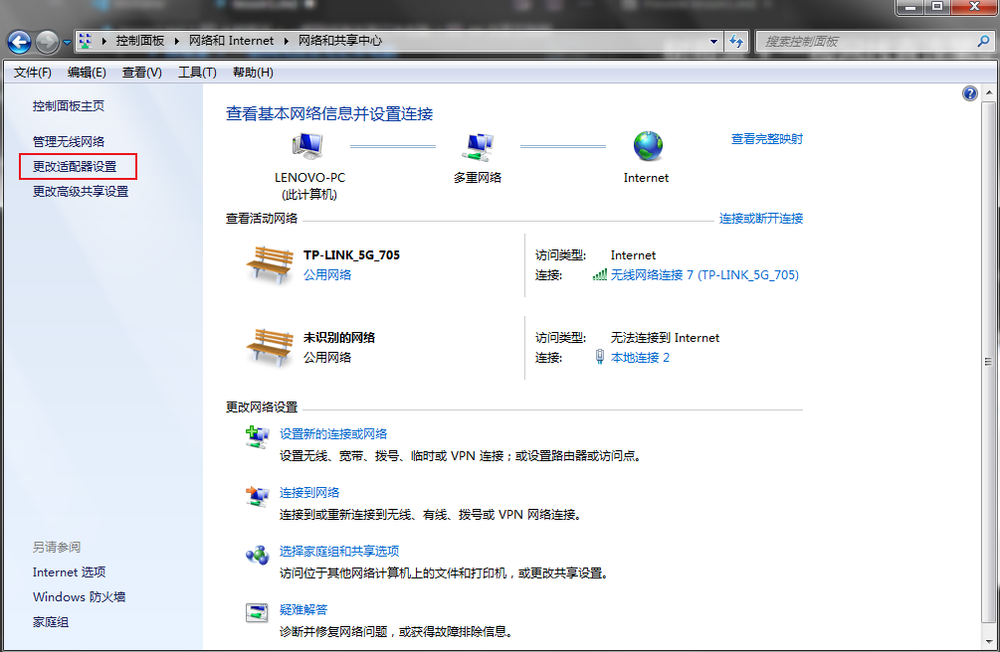
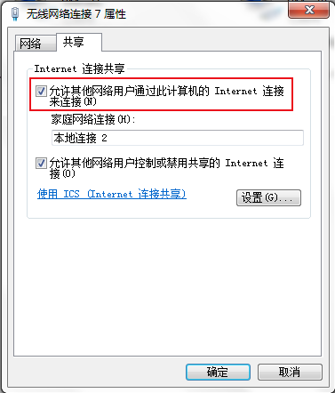
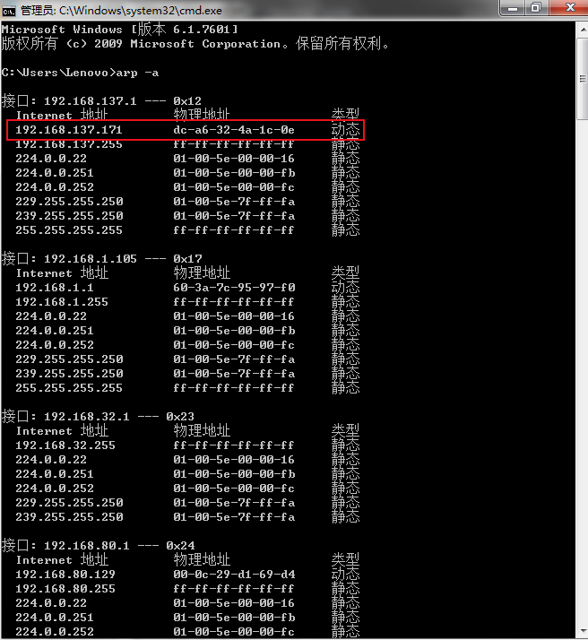
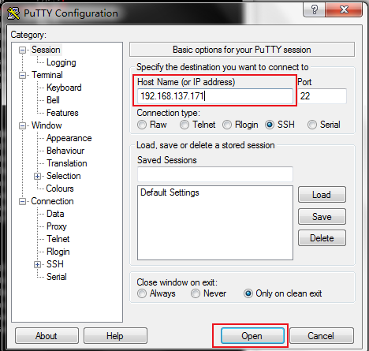
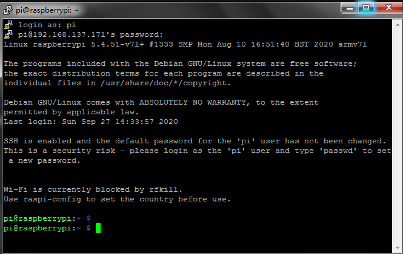
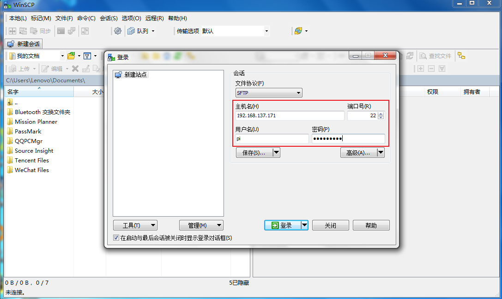
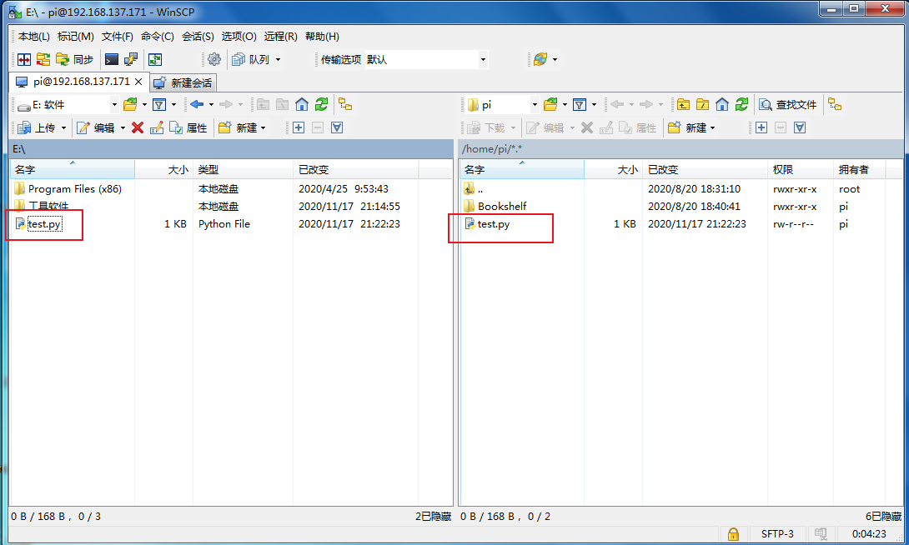

# 树莓派 + 一根网线直连笔记本电脑

## 连线

a.树莓派接好供电线。

b.将网线一端接到树莓派，另一端接到笔记本。

c.笔记本连接好无线网络。

## 共享互联网

a.如下图，进入“控制面板\网络和 Internet\网络和共享中心”页面，选择左边的“更改适配器设置”。



b.选中已连接的无线网络，右键“属性”，在“共享”页面选中“允许其他网络用户通过此计算机上的Internet连接来连接”，点确定。



## 查找树莓派的IP地址

windowns开始菜单栏输入cmd，运行DOS窗口，输入```arp -a```，在接口192.168.137.1下的为动态类型的IP地址
，就是树莓派的地址。



## 利用Putty软件连接树莓派

a.如图所示，输入树莓派IP地址，点“open”，第一次弹出对话框，选择“是”。



b.按照提示，输入登录用户名和密码，密码不显示，密码输入完成，按回车，进入登录成功页面。

用户名：```pi```
密码：```raspberry```



## 利用WinSCP传输文件到树莓派

登录树莓派，拖拽文件到树莓派





## 编写test.py(斐波纳契数列)代码

```
#!/usr/bin/python3
a, b = 0, 1
while b < 10:
    print(b)
    a, b = b, a+b
```

## 在树莓派上运行test.py脚本

a.查看python3版本

```
pi@raspberrypi:~ $ python3 -V
Python 3.7.3
```

b.执行脚本

```
pi@raspberrypi:~ $ python test.py
1
1
2
3
5
8
```
