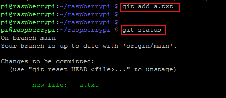

# git使用

## 注册github账号

github官网```https://github.com/```

GitHub 是一个面向开源及私有软件项目的托管平台，因为只支持 Git 作为唯一的版本库格式进行托管，故名 GitHub。

Git 是一个开源的分布式版本控制系统，用于敏捷高效地处理任何或小或大的项目。

Git 是 Linus Torvalds 为了帮助管理 Linux 内核开发而开发的一个开放源码的版本控制软件。

## github创建代码仓库

1.登录github，按下图所示，点击”New repository“：


2.配置新仓库：

(1)填写仓库名”Repository name“。

(2)权限选择”Public“，Anyone on the internet can see this repository.

(3)选中”Add a README file“,使创建仓库时就有一个文件README.md。


3.配置完成后，点击”Create repository“，完成仓库创建。


## 树莓派上使用git

1.利用Putty软件登录树莓派。

2.查看git是否安装。


which命令：用于查找某款软件是否安装。

3.使用git clone命令下载仓库到树莓派，仓库路径可以从github上获取到：

获取方式：


下载命令：

```
git clone https://github.com/weizhangCJLU/raspberrypi.git
```


4.进入到仓库路径下


cd命令：cd就是change directory的缩写，即改变目录。

pwd命令：英文全拼，print work directory， 该命令用于显示工作目录。

ls命令：英文全拼，list files，该命令用于显示指定工作目录下之内容（列出目前工作目录所含之文件及子目录)。

5.创建一个新文件a.txt。


touch命令：用于修改文件或者目录的时间属性，包括存取时间和更改时间。若文件不存在，系统会建立一个新的文件。

6.使用git status查看仓库状态。


7.使用git add命令把新文件添加到仓库。

```
 git add a.txt
```



8.使用git commit命令把新文件提交到仓库。

git commit命令：

```
git commit -m "Add a.txt"
```

第一次提交报错：


报错原因是git尚未配置邮箱和用户名，对git进行配置，例如：

```
git config --global user.email "keyuyukuaiee@qq.com"
git config --global user.name "weizhangCJLU"
```

配置后再次git commit成功：


9.使用git log查看提交日志。


10.查看仓库当前分支名。


11.使用git push同步到远程仓库，也就是同步到github上，注意分支名要正确。

git push命令：

```
git push origin main
```


## 刷新github代码仓库

刷新前：


刷新后：


## git使用总结


