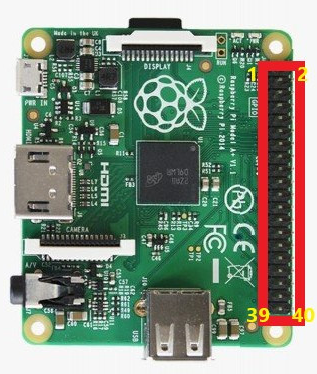

# GPIO学习

## GPIO概念

先让学生从网上了解GPIO相关背景知识。

GPIO（英语：General-purpose input/output），通用型之输入输出的简称。

通俗地说，就是一些引脚，可以通过它们输出高低电平或者读入它们的状态-是高电平或是低电平。

## 树莓派GPIO介绍

先让学生从网上了解树莓派的具体用途和相关硬件基本知识。

树莓派4B硬件布局：


GPIO图：




## 控制LED闪烁

先让学生从网上了解LED相关背景知识及电路控制原理。

LED的正极连接某一个GPIO通道，例如BCM21，负极接地。

文件是led_blink.py，程序如下：

```
import RPi.GPIO as GPIO            #导入树莓派提供的python模块
import time                        #导入时间包，用于控制闪烁

GPIO.setmode(GPIO.BCM)         #设置GPIO模式，BCM模式在所有树莓派通用
GPIO.setup(21, GPIO.OUT)       #设置GPIO21为输出

while True:
    GPIO.output(21, GPIO.HIGH)      #GPIO21 输出3.3V
    time.sleep(0.5)                 #程序控制流程睡眠0.5秒
    GPIO.output(21, GPIO.LOW)       #GPIO21 输出0V
    time.sleep(0.5)                 #程序控制流程睡眠0.5秒
```

## 呼吸灯制作

先让学生从网上了解什么是呼吸灯。

LED的正极连接某一个GPIO通道，例如BCM21，负极接地。

文件是led_breath.py，程序如下：

```
import RPi.GPIO as GPIO
import time

GPIO.setmode(GPIO.BCM)
GPIO.setup(21, GPIO.OUT)

# 创建一个 PWM 实例，需要两个参数，第一个是GPIO端口号，这里我们用14号
# 第二个是频率（Hz），频率越高LED看上去越不会闪烁，相应对CPU要求就越高，设置合适的值就可以
pwm = GPIO.PWM(21, 80)

# 启用 PWM，参数是占空比，范围：0.0 <= 占空比 >= 100.0
pwm.start(0)

try:
	while True:
		# 电流从小到大，LED由暗到亮
		for i in range(0, 101, 1):
			# 更改占空比，
			pwm.ChangeDutyCycle(i)
			time.sleep(.02)
			
		# 再让电流从大到小，LED由亮变暗
		for i in range(100, -1, -1):
			pwm.ChangeDutyCycle(i)
			time.sleep(.02)

# 最后一段是一个小技巧。这个程序如果不强制停止会不停地执行下去。
# 而Ctrl+C强制终端程序的话，GPIO口又没有机会清理。
# 加上一个try except 可以捕捉到Ctrl+C强制中断的动作，
# 试图强制中断时，程序不会马上停止而是会先跳到这里来做一些你想做完的事情，比如清理GPIO口。
except KeyboardInterrupt:
	pass

# 停用 PWM
pwm.stop()

# 清理GPIO口
GPIO.cleanup()
```

## 按钮控制LED开关

先让学生从网上了解按钮相关背景知识及使用原理。

让按钮的VCC引脚接3.3V，GND引脚接地，OUT引脚接BCM17。

实现按钮按下，LED灯亮，按钮松开，LED灯灭。

文件是led_key_ctrl.py，程序如下：

```
import RPi.GPIO as GPIO
import time

GPIO.setmode(GPIO.BCM)
GPIO.setup(21,GPIO.OUT)
GPIO.setup(17,GPIO.IN,pull_up_down=GPIO.PUD_DOWN)

while True:
    if(GPIO.input(17)==GPIO.HIGH):
        GPIO.output(21, GPIO.HIGH)
    else:
        GPIO.output(21, GPIO.LOW)
    time.sleep(.01)
```

## 使用红外传感器实现手势控制LED开关

先让学生从网上了解红外传感器相关背景知识及使用原理。

让红外传感器的VCC引脚接3.3V，GND引脚接地，OUT引脚接BCM17。

实现用手挡住红外传感器，LED灯亮，不挡住，LED灯灭。

红外传感器硬件连接方式与按钮一样，但程序有细微区别。

红外传感器信号输入和按钮输入都可作为系统的输入。

文件是led_infrared_ctrl，程序如下：

```
import RPi.GPIO as GPIO
import time

GPIO.setmode(GPIO.BCM)
GPIO.setup(21,GPIO.OUT)
GPIO.setup(17,GPIO.IN,pull_up_down=GPIO.PUD_DOWN)

while True:
    if(GPIO.input(17)==GPIO.HIGH):
        GPIO.output(21, GPIO.LOW)
    else:
        GPIO.output(21, GPIO.HIGH)
    time.sleep(.01)
```
