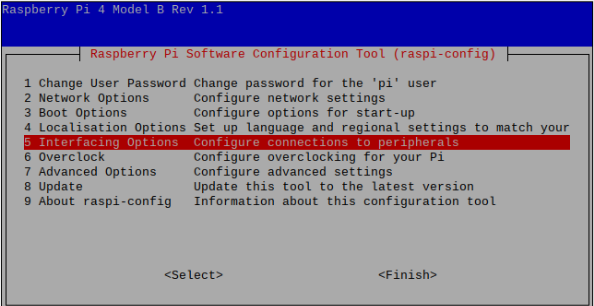
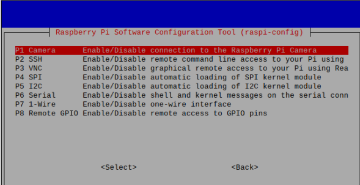
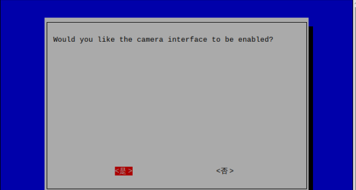
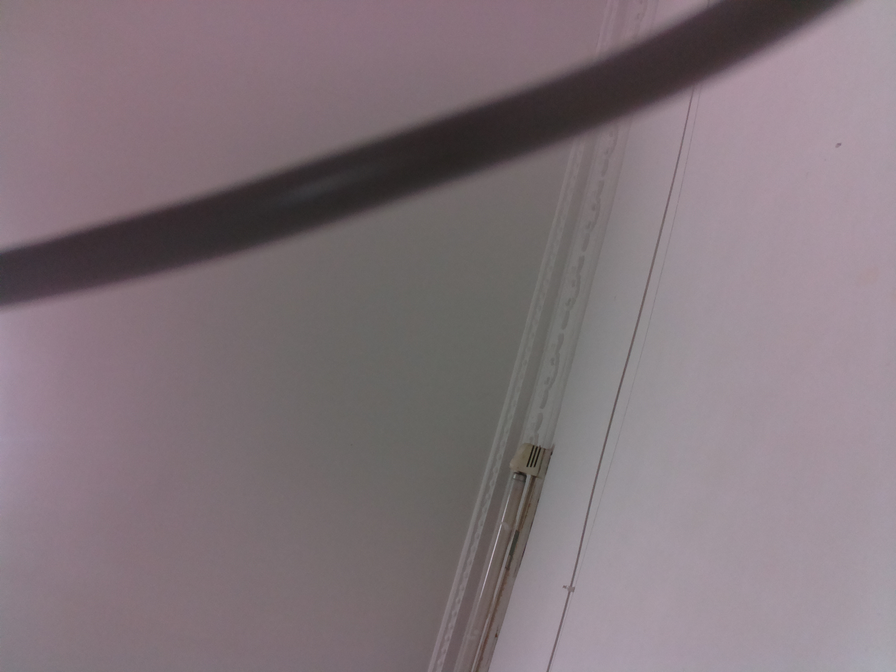
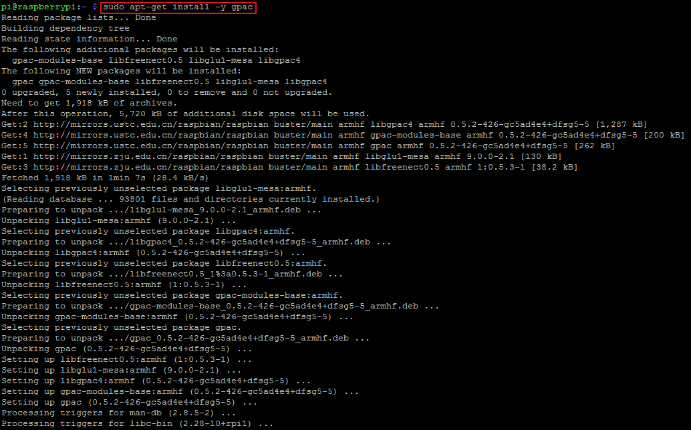
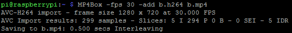
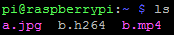

# 摄像头拍照和录像

## 排线连接

硬件连接时我们首先需要使用树莓派摄像头FFC排线，连接树莓派摄像头与树莓派开发板。其中排线连接的接口被称为CSI（Camera Serial Interface）接口。

## 摄像头功能激活

1.登录树莓派命令行界面，输入如下命令，打开树莓派的配置界面：

```
sudo raspi-config
```

2.按照以下步骤找到摄像头选项，打开树莓派的摄像头功能：







3.使用```sudo reboot```指令重启树莓派，然后重新登录树莓派命令行界面。

## 拍照

1.想使用树莓派摄像头拍照很简单，在终端输入命令即可。这里使用的是树莓派系统中的raspistill命令：

```
raspistill -o a.jpg -t 1000
```

2.这行命令的作用是在一秒钟的延迟之后，拍下一张名为a.jpg的照片，保存在树莓派的主目录下。-t的延迟选项后的参数是以毫秒为单位，1000便表示1秒。下面放一张效果图：



## 录像

1.同样是使用输入命令的方式实现。命令如下：

```
raspivid -o b.h264 -t 10000 -w 1280 -h 720
```

该命令的意思是录制一段十秒钟的名为b.h264的视频，且分辨率为1280x720。

2.此时录制的视频虽然能够在树莓派上播放，但并非是能够在一般播放器上运行的常规视频文件，且录制的视频是没有声音的。要想将.h264格式的视频转换为mp4格式的视频，需要使用一个叫做gpac的工具。

```
sudo apt-get install -y gpac
```



3.安装后输入以下命令对刚才的视频进行格式转换，转换后的视频为每秒30帧，视频名为b.mp4。

```
MP4Box -fps 30 -add b.h264 b.mp4
```




